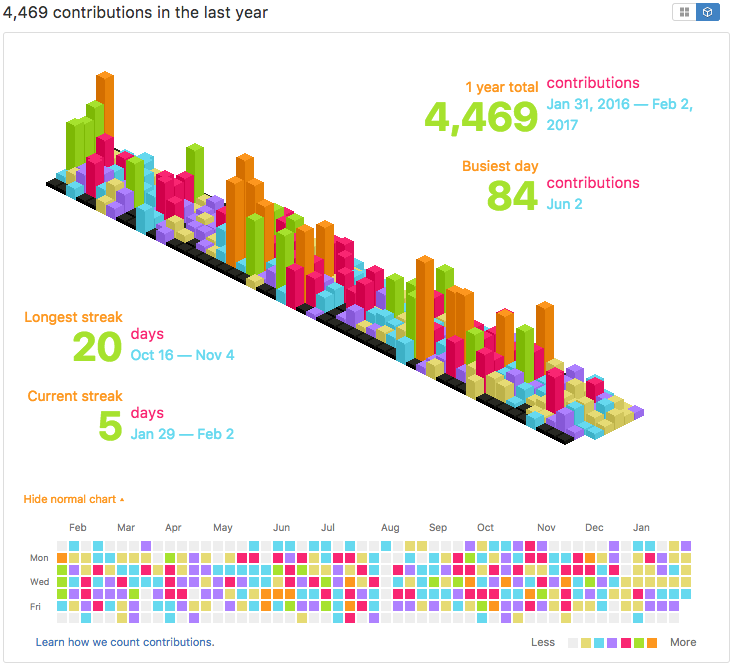

## Monokai Isometric Contributions

  </img>

This is an extension for Chrome, ~~Safari~~ (see note below), and Firefox (beta) that lets you toggle between your regular GitHub contribution chart and an isometric pixel art version. It uses [obelisk.js](https://github.com/nosir/obelisk.js) for the isometric graphics.

Besides being sort of neat looking, this view is interesting in that it highlights the differences between the number of contributions with more granularity. This isn't meant to completely replace the standard 2D graph though, because in most ways it is actually less useful. For example, there are no axis labels, shorter bars can be hidden behind taller ones, you can't hover over a bar to see the day and count, etc.

## Installation

**NOTE: When installing this extension, you will likely see a warning about it needing access to all domains, not just github.com. This is required for people who are using GitHub Enterprise since it can be installed on any domain name.**

You'll need to install it manually. First clone or fork this repo. Then, on your Chrome Extensions page, make sure "Developer mode" is checked. You can then click the "Load unpacked extension..." button and browse to the `chrome` directory of this repo.

## Hacking

To hack on the extension, you'll first need to make sure you've installed it in Developer mode (see above). Once you've made changes to the extension, go back to the Extensions page and click the Reload link under the extension entry.

As of `v0.8.3`, this project uses CoffeeScript. To compile the `iso.coffee` file to all extensions:

    src/build.sh

Feel free to send a pull request if you've made an improvement.

## License

This project is licensed under the [MIT License](http://opensource.org/licenses/MIT).
